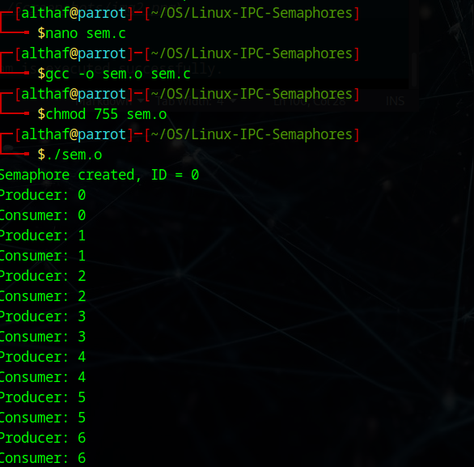
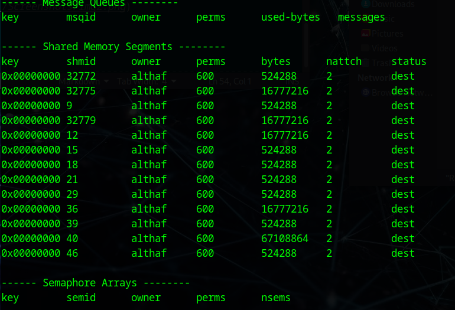

# Linux-IPC-Semaphores
Ex05-Linux IPC-Semaphores

# AIM:
To Write a C program that implements a producer-consumer system with two processes using Semaphores.

# DESIGN STEPS:

### Step 1:

Navigate to any Linux environment installed on the system or installed inside a virtual environment like virtual box/vmware or online linux JSLinux (https://bellard.org/jslinux/vm.html?url=alpine-x86.cfg&mem=192) or docker.

### Step 2:

Write the C Program using Linux Process API - Sempahores

### Step 3:

Execute the C Program for the desired output. 

# PROGRAM:

## Write a C program that implements a producer-consumer system with two processes using Semaphores.

```
#include <stdio.h>
#include <stdlib.h>
#include <unistd.h>
#include <sys/types.h>
#include <sys/ipc.h>
#include <sys/sem.h>
#include <sys/wait.h>

#define NUM_LOOPS 10

union semun {
    int val;
    struct semid_ds *buf;
    unsigned short *array;
    struct seminfo *__buf;
};

void wait_semaphore(int id) {
    struct sembuf op = {0, -1, 0};
    semop(id, &op, 1);
}

void signal_semaphore(int id) {
    struct sembuf op = {0, 1, 0};
    semop(id, &op, 1);
}

int main() {
    int id = semget(IPC_PRIVATE, 1, 0600);
    union semun val;

    if (id == -1) {
        perror("semget");
        exit(1);
    }

    printf("Semaphore created, ID = %d\n", id);

    val.val = 0;
    semctl(id, 0, SETVAL, val);

    if (fork() == 0) {
        for (int i = 0; i < NUM_LOOPS; i++) {
            wait_semaphore(id);
            printf("Consumer: %d\n", i);
        }
        exit(0);
    } else {
        for (int i = 0; i < NUM_LOOPS; i++) {
            printf("Producer: %d\n", i);
            signal_semaphore(id);
            usleep(500000);
        }

        wait(NULL);
        semctl(id, 0, IPC_RMID, val);
        printf("Semaphore removed.\n");
    }

    return 0;
}
```


## OUTPUT
$ ./sem.o 



$ ipcs




# RESULT:
The program is executed successfully.
