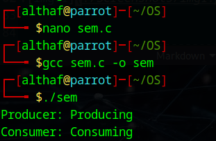
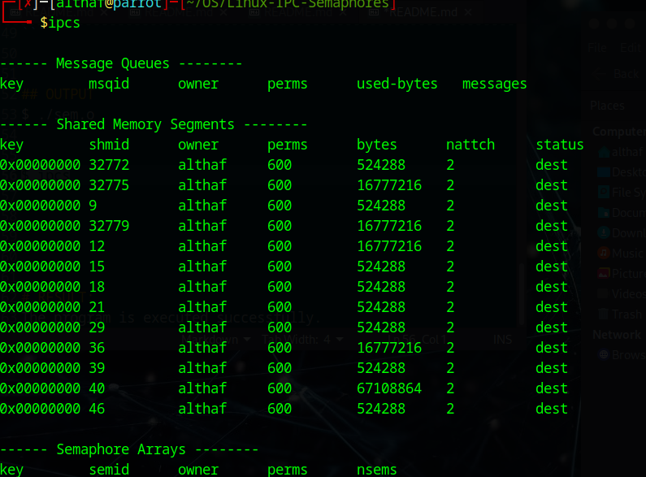

# Linux-IPC-Semaphores
Ex05-Linux IPC-Semaphores

# AIM:
To Write a C program that implements a producer-consumer system with two processes using Semaphores.

# DESIGN STEPS:

### Step 1:

Navigate to any Linux environment installed on the system or installed inside a virtual environment like virtual box/vmware or online linux JSLinux (https://bellard.org/jslinux/vm.html?url=alpine-x86.cfg&mem=192) or docker.

### Step 2:

Write the C Program using Linux Process API - Sempahores

### Step 3:

Execute the C Program for the desired output. 

# PROGRAM:

## Write a C program that implements a producer-consumer system with two processes using Semaphores.

```
#include <stdio.h>
#include <unistd.h>
#include <sys/wait.h>
#include <semaphore.h>

int main() {
    sem_t s;
    sem_init(&s, 1, 1);

    if (fork() == 0) {
        sem_wait(&s);
        printf("Producer: Producing\n");
        sem_post(&s);
    } else {
        wait(NULL);
        sem_wait(&s);
        printf("Consumer: Consuming\n");
        sem_post(&s);
    }

    sem_destroy(&s);
    return 0;
}
```


## OUTPUT
$ ./sem.o 



$ ipcs




# RESULT:
The program is executed successfully.
